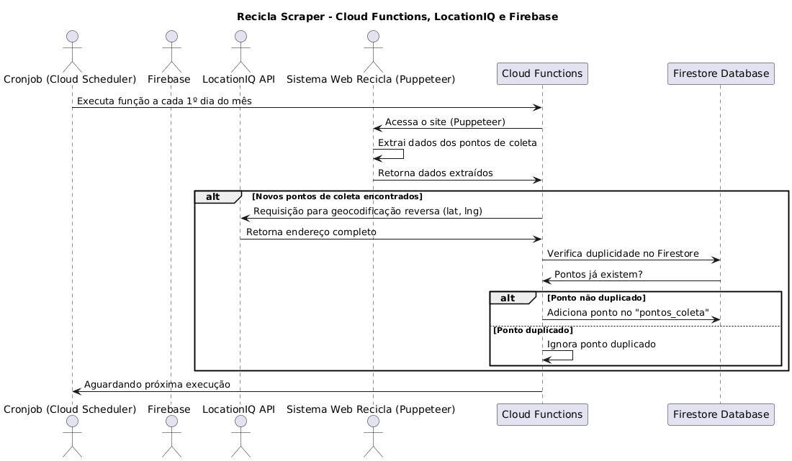

# Projeto de Scraping Automático de Pontos de Coleta

Este projeto realiza o scraping de dados de pontos de coleta de reciclagem do [localizador](https://sistema.gmclog.com.br/info/green?button=&search_city=&search_state=SP) e utiliza a API de geocodificação reversa **LocationIQ** para obter informações detalhadas sobre os endereços dos pontos de coleta. O código está atualmente configurado para ser testado localmente, mas também foi planejado para ser implementado em produção com **Google Cloud Functions** e **Firestore** como banco de dados, através do Flutter Flow.

## Estrutura do Projeto

### 1. Código Atual (Ambiente Local)

Atualmente, o scraping é executado localmente com **Puppeteer** para acessar o [localizador](https://sistema.gmclog.com.br/info/green?button=&search_city=&search_state=SP), e a API **LocationIQ** é usada para enriquecer os dados de latitude e longitude com endereços completos.

#### Como Funciona:

- **Puppeteer** acessa o [localizador](https://sistema.gmclog.com.br/info/green?button=&search_city=&search_state=SP) e extrai os pontos de coleta.
- O script então faz uma requisição à **LocationIQ** para obter os detalhes do endereço completo baseado na latitude e longitude de cada ponto.
- Os dados são salvos em um arquivo `pontos_de_coleta.txt` em formato estruturado.

#### Estrutura de uma localização extraída do site:

Os dados de localização são extraídos do [localizador](https://sistema.gmclog.com.br/info/green?button=&search_city=&search_state=SP) e têm a seguinte estrutura:

    {
    "lat": -23.52562441,
    "lng": -46.5699766,
    "title": "01 - ATACADÃO MATRIZ, AV. MORVAN DIAS DE FIGUEIREDO, 6169, VILA MARIA"
    }

#### Estrutura resultante da API Location IQ:

Quando fazemos uma requisição de geocodificação reversa para a API LocationIQ, recebemos uma estrutura de dados com informações detalhadas sobre o local, como mostrado abaixo:

    {
    "place_id": "152941129",
    "licence": "https://locationiq.com/attribution",
    "osm_type": "way",
    "osm_id": "128526755",
    "lat": "-23.52562441",
    "lon": "-46.5699766",
    "display_name": "Marginal Tietê (Expressa), Parque Novo Mundo, Vila Maria, São Paulo, Região Metropolitana de São Paulo, São Paulo, Southeast Region, 02180-040, Brazil",
    "class": "highway",
    "type": "secondary",
    "importance": 0.30001
    }

#### Requisitos:

- Node.js
- Puppeteer
- API Key da **LocationIQ**
- Node Fetch para requisições HTTP
- **dotenv** para gerenciar variáveis de ambiente

#### Como Executar o Código Localmente:

1. Clone o repositório:
   ```
   git clone https://github.com/joaospdro/recicla-scraper.git
   cd recicla-scraper
  
2. Instale as dependências:
    ```bash
    npm install
    
3. Crie um arquivo `.env` na raiz do projeto e adicione sua chave da API LocationIQ:

    ```bash
    echo "LOCATIONIQ_API_KEY=SUA_CHAVE_API_LOCATIONIQ" > .env

4. Execute o script:

    ```bash
    node scraper.js

5. O resultado será salvo no `pontos_de_coleta.txt`.

#### Exemplo de saída:

    Nome: ATACADÃO MATRIZ, Endereço Completo: Marginal Tietê (Expressa), Parque Novo Mundo, Vila Maria, São Paulo, Região Metropolitana de São Paulo, São Paulo, 02180-040, Brazil, Latitude: -23.52562441, Longitude: -46.5699766
    Nome: ATACADÃO SÃO JOSÉ DO RIO PRETO, Endereço Completo: Atacadão, Rua Silva Jardim, Vila Santa Cruz, São José do Rio Preto, São Paulo, 15014-050, Brazil, Latitude: -20.81935451, Longitude: -49.37361375
    
### 2. Futuro (Ambiente de Produção):

O plano para produção envolve rodar o scraping automaticamente de forma periódica, utilizando **Cloud Functions** no FlutterFlow/Firebase e armazenando os dados diretamente no **Firestore Database**.

#### Como Funcionaria em Produção:

- Um ****Cronjob**** dispara uma função em **Cloud Functions** no primeiro dia de cada mês (a determinar periodicidade).
- A função acessa o [localizador](https://sistema.gmclog.com.br/info/green?button=&search_city=&search_state=SP) utilizando **Puppeteer** para extrair os dados de coleta.
- A API ****LocationIQ**** é chamada para geocodificação reversa, enriquecendo os dados de latitude e longitude com endereços completos.
- Antes de adicionar os dados no **Firestore Database**, a função verifica duplicidades (pontos de coleta já existentes) para evitar registros duplicados.
- Novos pontos são armazenados na estrutura `pontos_coleta`.

### Diagrama do Processo:



### To-do:

- Refatorar o código ou adicionar mais funcionalidades.
- Testar e prevenir possíveis problemas no processo de scraping.
- Verificar se o uso do **Cloud Functions** é possível pro contexto, pois essa funcionalidade, apesar de ter um plano free-tier, pode requerer cadastrar dados de cobrança.
- Caso o **Cloud Functions** não seja viável para o contexto, podemos utilizar algum serviço de cloud free tier.